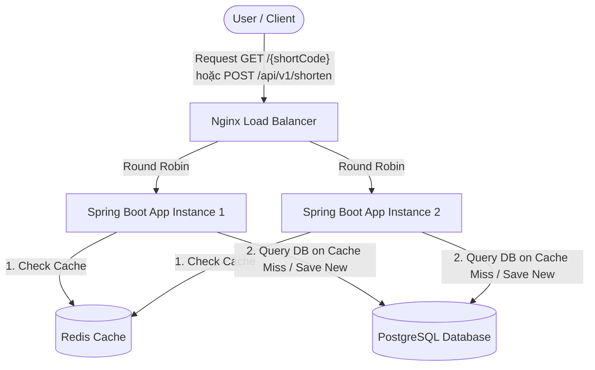

# Hệ thống Rút gọn Link (Nano URL - Clone TinyURL)

Dự án này triển khai một hệ thống rút gọn URL (TinyURL clone) hiệu năng cao, tập trung vào việc áp dụng các kiến thức nền tảng về thiết kế hệ thống (System Design), cơ sở dữ liệu, caching, và cân bằng tải (load balancing).

---

## 🚀 Các Thành Phần Kiến Trúc & Tính Năng

### 1. Networking & API Design

Thiết kế RESTful API chuẩn hóa để xử lý các yêu cầu từ phía Client:

- `POST /api/v1/shorten`: Tạo link rút gọn từ link gốc.
- `GET /{shortCode}`: Chuyển hướng (Redirect 302 Found) từ mã ngắn về URL gốc.

### 2. Thuật Toán Sinh Short Code (Base62 Encoding)

- Sử dụng phương pháp **Auto-increment ID + Base62 Encoding** để sinh mã ngắn.
- **Luồng hoạt động:**
  1. Lưu bản ghi chứa URL gốc vào Database để lấy ID tự tăng (ví dụ: `100000`).
  2. Mã hóa ID này sang chuỗi ký tự Base62 (gồm các ký tự `0-9`, `a-z`, `A-Z`). Ví dụ: ID `100000` được mã hóa thành `q0U`.
- **Ưu điểm:** Đảm bảo tính duy nhất tuyệt đối, hoàn toàn tránh được đụng độ mã (collision free) và độ dài chuỗi ngắn tối ưu.

### 3. Chiến Lược Caching (Cache-Aside với Redis)

- Sử dụng Redis để tối ưu hóa tốc độ đọc (truy cập link ngắn).
- **Luồng xử lý (Cache-Aside):**
  1. Khi người dùng truy cập mã ngắn, hệ thống kiểm tra trong Redis Cache trước.
  2. Nếu **Cache Hit** (tìm thấy): Chuyển hướng người dùng trực tiếp.
  3. Nếu **Cache Miss** (không tìm thấy): Truy vấn trong cơ sở dữ liệu PostgreSQL.
  4. Nếu tìm thấy trong DB, ghi ngược lại Redis với thời hạn hết hạn **TTL (Time-To-Live)** phù hợp và thực hiện chuyển hướng.

### 4. Cân Bằng Tải & Mở Rộng (Load Balancing & Scaling)

- Triển khai 2 instance backend chạy Spring Boot đồng thời để phân tán tải.
- Đứng trước các instance backend là một **Nginx Load Balancer** chạy thuật toán **Round Robin** để phân phối đều các request đến các backend app.

---

## 🛠️ Công Nghệ Sử Dụng (Techstack)

- **Language & Frontend:** Typescript, Nuxt
- **Language & Backend:** Java (Spring Boot)
- **Database (Relational):** PostgreSQL
- **Cache:** Redis
- **Load Balancer:** Nginx
- **Containerization:** Docker & Docker Compose

---

## 📐 Kiến Trúc Luồng Chạy (System Architecture Flow)

Dưới đây là sơ đồ luồng hoạt động tổng thể của hệ thống:

---

## 🔧 Hướng Dẫn Chạy Dự Án

_(Phần này sẽ được cập nhật chi tiết sau khi hoàn thiện mã nguồn cấu hình Docker Compose và mã nguồn Java Spring Boot)_
